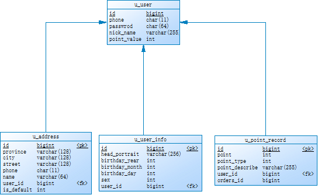
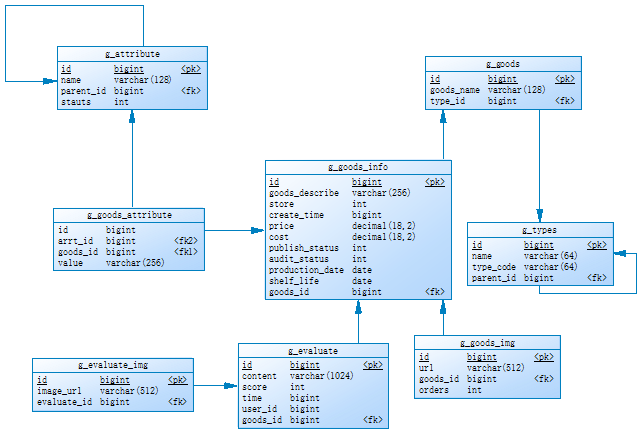
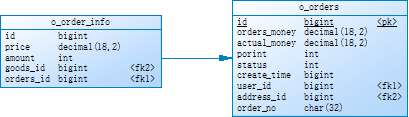

# 项目简介

### 1.1 概述

电子商务，简称电商，是指在[互联网](https://baike.baidu.com/item/%E4%BA%92%E8%81%94%E7%BD%91/199186)（Internet）、[内部网](https://baike.baidu.com/item/%E5%86%85%E9%83%A8%E7%BD%91/420144)（Intranet）和增值网（VAN，Value Added  Network）上以电子交易方式进行交易活动和相关服务活动，使传统商业活动各环节的电子化、网络化。电子商务包括电子货币交换、供应链管理、电子交易市场、网络营销、在线事务处理、电子数据交换（EDI）、存货管理和自动数据收集系统。在此过程中，利用到的信息技术包括：互联网、外联网、电子邮件、数据库、电子目录和移动电话。 

### 1.2主要功能

​	电子商务可提供网上交易和管理等全过程的服务，因此它具有广告宣传、咨询洽谈、网上订购、网上支付、电子帐户、服务传递、意见征询、交易管理等各项功能。 

### 2.1  数据库设计

#### 2.1.1 用户服务

#### 2.1.2  商品服务

#### 2.1.3  订单服服务

### 3.1  项目搭建

#### 	3.1.1	技术选型

​	项目结构 : 

​		1.	前后端分离

​		2.	分布式微服务

​	开发工具 ：

​		1.	后端开发工具：IntelliJ IDEA

​		2.	前端开发工具：HBuilderX

​		3.	接口测试工具：Postman

​		4.	MySQL客户端：Navicat

​	JDK : 

​		1.	JDK1.8

​	后端开发框架 : 

​		1.	SpringBoot 2.3.12.RELEASE 

​		2.	SpringCloud Hoxton.SR11

​		3.	MyBaits

​	前端开发框架：

​		1.	vue

​		2.	jQuery

​	数据存储 ：

​		1.	MySQL 5.7.18

​		2.	Redis 3.2.9

​		3.	RabbitMQ 3.7.2

​	Web服务器：

​		1.	Tomcat 9

​		2.	Nginx 1.14.2

​	其他组件：

​		1.	Eureka注册中心
​		2.	OpenFeign Web服务访问客户端
​		3.	FastJson Json工具
        4. Seata 分布式事务框架
    
    
   #### 4.1内置功能

   1. Eureka注册中心：用于发现并注册服务。

   2. 用户服务：用于对用户的信息进行验证，登录以及存储。

   3. 商品服务：对商品的评论进行展示，等级划分以及商品库存的调用。

   4. 订单功能：用于记录订单信息以及订单详情，根据支付状态的不同改变订单的状态信息。

   5. 定时任务：设定定时任务对未支付或者已经支付没有发货的订单进行监控，防止出现掉单等情况。

   #### 5.1快速体验

   1. 具备运行环境：JDK1.8，apache-maven-3.8.2，MySql5+，redist 6.0 +，seata 1.4.2，rabbitmq 3.7。
   2. 修改\src\main\resources\application.properties 中的数据库参数，redis以及mq的参数。
   3. 根据修改参数创建对应MySql数据库用户和参数。
   4. 将通用工程模块打包到maven本地库
   5. 将服务都配置好，注册到Eureka注册中心。